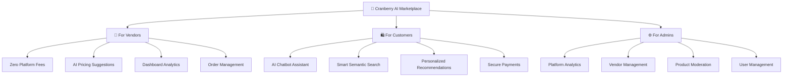
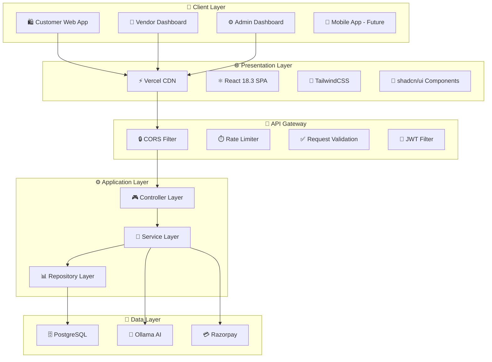
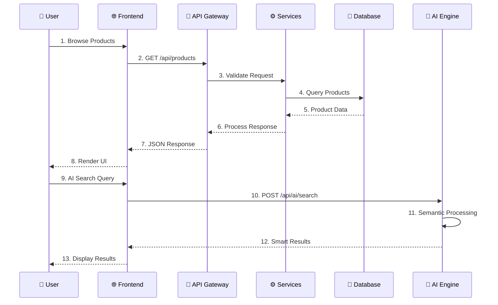
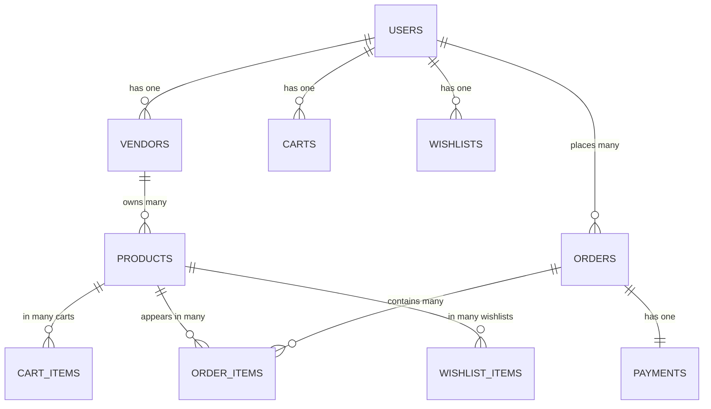

<div align="center">

# Cranberry

## AI-Powered Multi-Vendor E-Commerce Platform

**Democratizing E-Commerce Technology for Small Businesses**

[](https://cranberry-ai-multivendor-e-commerce.vercel.app)
[](https://cranberry-ai-powered-multi-vendor-e.onrender.com/api/health)
[](https://react.dev)
[](https://spring.io)
[](https://postgresql.org)
[](LICENSE)

**Zero Platform Fees • AI-Powered Features • Enterprise-Grade Technology**

</div>

---

## 📋 Table of Contents

- [Live Demo](#-live-demo)
- [Problem Statement](#-problem-statement)
- [Our Solution](#-our-solution)
- [UN Sustainable Development Goals](#-un-sustainable-development-goals)
- [System Architecture](#-system-architecture)
- [Features](#-features)
- [Tech Stack](#-tech-stack)
- [Database Design](#-database-design)
- [API Architecture](#-api-architecture)
- [AI/ML Pipeline](#-aiml-pipeline)
- [Security Architecture](#-security-architecture)
- [Deployment Architecture](#-deployment-architecture)
- [Getting Started](#-getting-started)
- [API Documentation](#-api-documentation)
- [Future Roadmap](#-future-roadmap)
- [Team](#-team)

## 🌐 Live Demo

| Component | URL | Status |
|-----------|-----|--------|
| **Web Application** | [cranberry-ai-multivendor-e-commerce.vercel.app](https://cranberry-ai-multivendor-e-commerce.vercel.app) | ✅ Live |
| **REST API** | [cranberry-ai-powered-multi-vendor-e.onrender.com](https://cranberry-ai-powered-multi-vendor-e.onrender.com) | ✅ Live |
| **Health Check** | [/api/health](https://cranberry-ai-powered-multi-vendor-e.onrender.com/api/health) | ✅ Active |

### Demo Credentials

| Role | Email | Password |
|------|-------|----------|
| Admin | admin@cranberry.com | password |
| Vendor | techvista@cranberry.com | password |
| Customer | aryan@example.com | password |

---

## 🖼️ Platform Screenshots

<div align="center">

| Customer Experience | Vendor Management | Admin Analytics |
|-------------------|------------------|----------------|
|  |  |  |

| Product Discovery | Shopping Cart | Secure Checkout |
|------------------|---------------|----------------|
|  |  |  |

</div>

---


---

## 🖼️ Demo Screenshots


Below are key screenshots showcasing the Cranberry platform in action:

| Cart | Product Detail | Home Page |
|------|---------------|------------|
|  |  |  |

| Products | Checkout | Razorpay Payment |
|----------|----------|--------------|
|  |  |  |

 Vendor Dashboard 
   
 Admin Dashboard 
 
---

## 🎯 The E-Commerce Challenge

### Market Barriers for Small Businesses

Small and medium businesses face significant obstacles in digital commerce:

<div align="center">

| 💰 **High Costs** | 🤖 **No AI Access** | 📊 **Limited Insights** |
|------------------|-------------------|----------------------|
| 15-30% platform fees | Enterprise AI costs $10K+/month | No customer behavior analytics |
| Per-transaction charges | Premium-only features | Manual inventory management |
| Hidden costs | Complex integrations | No market intelligence |

| 🔍 **Poor Discovery** | 😤 **Complex Checkout** | 📱 **Technical Barriers** |
|---------------------|---------------------|------------------------|
| Products lost among millions | 70% cart abandonment rate | No technical expertise required |
| Limited search capabilities | Complex payment flows | High development costs |
| No personalization | Multi-step processes | Maintenance overhead |

</div>

### Market Impact

| Metric | Statistic | Source |
|--------|-----------|--------|
| **Digital Transformation Struggle** | 60% of SMBs | World Bank 2024 |
| **Global Cart Abandonment** | $4.6 Trillion annually | Baymard Institute |
| **Personalization Expectation** | 73% of customers | Salesforce Report |
| **AI Tool Accessibility** | 89% cannot afford | Gartner Survey |

---

## 💡 Our Solution

**Cranberry** is a comprehensive AI-powered multi-vendor marketplace that democratizes e-commerce technology for small businesses.

<div align="center">

### 🎯 Platform Architecture



</div>

### 🚀 Competitive Advantages

| Feature | Traditional Platforms | 🍒 **Cranberry** |
|---------|----------------------|------------------|
| **Platform Fees** | 15-30% per sale | **0%** |
| **AI Chatbot** | Premium only ($$$) | ✅ **Included** |
| **Smart Search** | Basic keyword | 🤖 **AI-powered semantic** |
| **Price Optimization** | Not available | 💡 **AI suggestions** |
| **Personalization** | Enterprise tier | ✅ **For everyone** |
| **Setup Complexity** | High technical barrier | 📱 **Zero-code setup** |

---

## 🌍 UN Sustainable Development Goals

<div align="center">

### 🎯 Global Impact Alignment

Cranberry directly contributes to achieving key UN Sustainable Development Goals:

| 🎯 **SDG 8** | 🏗️ **SDG 9** | ⚖️ **SDG 10** | ♻️ **SDG 12** |
|-------------|--------------|---------------|--------------|
| **Decent Work & Economic Growth** | **Industry, Innovation & Infrastructure** | **Reduced Inequalities** | **Responsible Consumption & Production** |
| • Enables small vendors in digital economy | • Democratizes AI technology | • Levels playing field for businesses | • AI reduces wasteful purchases |
| • Zero-barrier entrepreneurship | • Modern e-commerce infrastructure | • Equal access to AI tools | • Smart inventory management |
| • Enterprise tools for all | • Promotes retail innovation | • Reduces economic disparities | • Data-driven sustainability |

</div>

---

## 🏗 System Architecture

<div align="center">

### 🎯 High-Level Architecture



</div>

### 🔧 Technology Stack

| Layer | Technology | Purpose |
|-------|------------|---------|
| **Frontend** | React 18.3 + Vite | Modern SPA with fast builds |
| **Styling** | TailwindCSS + shadcn/ui | Responsive, accessible UI |
| **Backend** | Spring Boot 3.4.2 | Enterprise-grade Java framework |
| **Database** | PostgreSQL 16 | Scalable relational database |
| **AI/ML** | Ollama (llama3.2, gemma3) | Local LLM for privacy |
| **Payments** | Razorpay | Secure payment processing |
| **Deployment** | Vercel + Render | Cloud-native infrastructure |

### 🔄 Component Flow

<div align="center">



</div>

---

## 🚀 Core Features

<div align="center">

### 🛍️ Customer Experience
- **🤖 AI Chatbot Assistant** - 24/7 intelligent customer support
- **🔍 Semantic Search** - Natural language product discovery
- **🎯 Personalized Recommendations** - AI-driven product suggestions
- **💳 Secure Payments** - Razorpay integrated checkout
- **📱 Responsive Design** - Mobile-first shopping experience

### 🏪 Vendor Management
- **💰 Zero Platform Fees** - Keep 100% of your revenue
- **📊 Dashboard Analytics** - Real-time business insights
- **💡 AI Price Suggestions** - Optimize pricing with AI
- **📦 Order Management** - Streamlined fulfillment workflow
- **🎨 Product Management** - Easy inventory control

### ⚙️ Admin Operations
- **📈 Platform Analytics** - Comprehensive business metrics
- **👥 Vendor Management** - Approve and manage vendors
- **🛡️ Content Moderation** - Product quality control
- **🔧 User Management** - Customer support tools
- **📊 Order Insights** - AI-powered business intelligence

</div>

---

## 🛠 Technology Stack

### Frontend Technologies
| Technology | Version | Purpose |
|------------|---------|---------|
| **React** | 18.3 | Modern SPA framework |
| **Vite** | 7.3.1 | Fast build tool |
| **React Router** | 7.5.1 | Client-side routing |
| **TailwindCSS** | 3.4.17 | Utility-first styling |
| **shadcn/ui** | 46+ components | Accessible UI library |
| **Axios** | 1.8.4 | HTTP client |

### Backend Technologies
| Technology | Version | Purpose |
|------------|---------|---------|
| **Spring Boot** | 3.4.2 | Enterprise framework |
| **Java** | 17 | Programming language |
| **Spring Security** | 6.x | Authentication & authorization |
| **Spring Data JPA** | 3.x | Database abstraction |
| **PostgreSQL** | 16 | Production database |
| **MySQL** | 8.0 | Development database |

### AI & Integration
| Technology | Purpose |
|------------|---------|
| **Ollama** | Local LLM deployment |
| **llama3.2** | Primary AI model |
| **gemma3** | Alternative AI model |
| **Razorpay** | Payment processing |
| **JWT** | Token-based auth |

---

## 📊 Database Design

### Entity Relationships


### Key Tables
| Table | Primary Key | Relationships |
|-------|-------------|---------------|
| **users** | id | 1:1 with vendors |
| **vendors** | id | 1:many with products |
| **products** | id | many:1 with vendors |
| **orders** | id | many:1 with users |
| **payments** | id | 1:1 with orders |

---

## 🔐 Security Architecture

### Authentication & Authorization
- **JWT Tokens** - Secure stateless authentication
- **Role-Based Access** - Customer, Vendor, Admin roles
- **BCrypt Encryption** - Password hashing
- **CORS Configuration** - Cross-origin security
- **Rate Limiting** - API protection

### Data Protection
- **Environment Variables** - Secure configuration
- **Input Validation** - Prevent injection attacks
- **SQL Injection Prevention** - Parameterized queries
- **HTTPS Enforcement** - Encrypted communication

---

## 🚀 Deployment Architecture

### Production Environment
| Component | Platform | Purpose |
|-----------|----------|---------|
| **Frontend** | Vercel CDN | Static hosting & CDN |
| **Backend** | Render | Spring Boot deployment |
| **Database** | Render PostgreSQL | Managed database |
| **AI Services** | Ollama (local) | LLM inference |
| **Payments** | Razorpay | Payment gateway |

### Development Environment
```bash
# Frontend Development
cd Cranberry-Frontend
npm install
npm run dev

# Backend Development
cd Cranberry-Backend
./mvnw spring-boot:run

# Full Stack with Docker
docker-compose up
```

---

## 📚 API Documentation

### Core Endpoints

#### Authentication
- `POST /api/auth/register` - User registration
- `POST /api/auth/login` - User login
- `POST /api/auth/google` - Google OAuth

#### Products
- `GET /api/products` - List products
- `GET /api/products/{id}` - Product details
- `POST /api/products` - Create product (vendor)
- `PUT /api/products/{id}` - Update product (vendor)

#### AI Services
- `POST /api/ai/chat` - AI chatbot
- `POST /api/ai/search` - Semantic search
- `POST /api/ai/recommend` - Recommendations
- `POST /api/ai/price-suggest` - Price optimization

#### Orders & Payments
- `POST /api/orders` - Create order
- `GET /api/orders` - User orders
- `POST /api/payments/create/{orderId}` - Initiate payment

### Response Format
```json
{
  "success": true,
  "message": "Operation successful",
  "data": { ... },
  "timestamp": "2026-02-12T15:30:00Z"
}
```

---

## 🚀 Getting Started

### Prerequisites
- **Node.js** 18.0.0+
- **Java** 17+
- **PostgreSQL** 16+ (or MySQL 8.0+)
- **Ollama** (for AI features)

### Quick Start

1. **Clone Repository**
```bash
git clone https://github.com/aryangaikwad-966/Cranberry-AI-Powered-Multi-Vendor-E-Commerce-Platform-.git
cd Cranberry-AI-Powered-Multi-Vendor-E-Commerce-Platform-
```

2. **Setup Backend**
```bash
cd Cranberry-Backend
cp .env.example .env
# Configure database and API keys
./mvnw spring-boot:run
```

3. **Setup Frontend**
```bash
cd Cranberry-Frontend
npm install
npm run dev
```

4. **Setup AI Services**
```bash
# Install Ollama
curl -fsSL https://ollama.ai/install.sh | sh

# Pull models
ollama pull llama3.2
ollama pull gemma3
```

### Docker Deployment
```bash
# Full stack deployment
docker-compose up -d

# Access services
# Frontend: http://localhost:3000
# Backend: http://localhost:8080
# API Health: http://localhost:8080/api/health
```

---

## 🔮 Future Roadmap

### Phase 1: Enhanced AI Features
- [ ] **Visual Search** - Image-based product discovery
- [ ] **Voice Commerce** - Voice-activated shopping
- [ ] **Predictive Analytics** - Demand forecasting
- [ ] **Dynamic Pricing** - Real-time price optimization

### Phase 2: Platform Expansion
- [ ] **Mobile Applications** - iOS & Android apps
- [ ] **Multi-Language Support** - Global localization
- [ ] **Advanced Analytics** - Business intelligence dashboard
- [ ] **Marketplace Integrations** - Third-party platforms

### Phase 3: Enterprise Features
- [ ] **B2B Solutions** - Wholesale marketplace
- [ ] **API Marketplace** - Third-party integrations
- [ ] **White-Label Solutions** - Custom deployments
- [ ] **Advanced AI Models** - Custom model training

---

## 👥 Team

<div align="center">

**🍒 Cranberry** is developed with passion for democratizing e-commerce technology.

### Core Contributors
- **[Aryan Gaikwad](https://github.com/aryangaikwad-966)** - Lead Developer & Architect
- **Open Source Community** - Contributors and collaborators

### Project Philosophy
- 💡 **Innovation First** - Pushing boundaries of e-commerce technology
- 🤖 **AI-Driven** - Leveraging artificial intelligence for business growth
- 🌍 **Global Impact** - Supporting small businesses worldwide
- 🚀 **Open Source** - Community-driven development

</div>

---

## 📄 License

This project is licensed under the **MIT License** - see the [LICENSE](LICENSE) file for details.

---

## 🤝 Contributing

We welcome contributions from the community! Please see our [Contributing Guidelines](CONTRIBUTING.md) for details.

### How to Contribute
1. Fork the repository
2. Create a feature branch
3. Make your changes
4. Add tests if applicable
5. Submit a pull request

---

## 📞 Contact & Support

<div align="center">

### 🌐 Live Demo
[**Visit Platform**](https://cranberry-ai-multivendor-e-commerce.vercel.app)

### 📧 Business Inquiries
- **Email**: business@cranberry.com
- **GitHub**: [aryangaikwad-966](https://github.com/aryangaikwad-966)

### 🐛 Bug Reports & Feature Requests
- **Issues**: [GitHub Issues](https://github.com/aryangaikwad-966/Cranberry-AI-Powered-Multi-Vendor-E-Commerce-Platform-/issues)
- **Discussions**: [GitHub Discussions](https://github.com/aryangaikwad-966/Cranberry-AI-Powered-Multi-Vendor-E-Commerce-Platform-/discussions)

---

<div align="center">

**⭐ Star this repository if you believe in democratizing e-commerce!**

**🍒 Join us in revolutionizing digital commerce for small businesses everywhere.**

</div>

</div>  