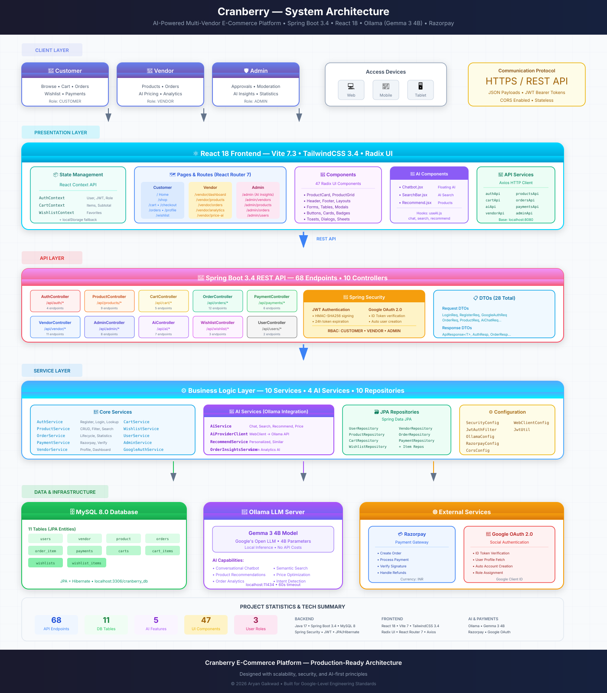

<p align="center">
  
</p>

<h1 align="center">C Cranberry</h1>
<h3 align="center">AI-Powered Multi-Vendor E-Commerce Marketplace</h3>

<p align="center">
  <strong>A production-ready, full-stack marketplace platform with AI-powered features</strong>
</p>

<p align="center">
  <a href="#-features"></a>
  <a href="#-tech-stack"></a>
  <a href="LICENSE"></a>
  <a href="#-quick-start"></a>
</p>

<p align="center">
  <a href="#-quick-start">Quick Start</a> •
  <a href="#-features">Features</a> •
  <a href="#-architecture">Architecture</a> •
  <a href="#-api-documentation">API Docs</a> •
  <a href="#-deployment">Deployment</a> •
  <a href="#-contributing">Contributing</a>
</p>

---

## 📋 Table of Contents

- [Overview](#-overview)
- [Features](#-features)
- [Tech Stack](#-tech-stack)
- [Architecture](#-architecture)
- [Quick Start](#-quick-start)
- [Project Structure](#-project-structure)
- [API Documentation](#-api-documentation)
- [Environment Variables](#-environment-variables)
- [Deployment](#-deployment)
- [Screenshots](#-screenshots)
- [Roadmap](#-roadmap)
- [Contributing](#-contributing)
- [License](#-license)
- [Author](#-author)

---

## 🎯 Overview

**Cranberry** is a comprehensive, AI-powered multi-vendor e-commerce marketplace built with modern technologies. It provides a complete solution for online marketplaces with separate dashboards for customers, vendors, and administrators.

### Why Cranberry?

- 🤖 **AI-First Approach**: Integrated AI chatbot, semantic search, personalized recommendations, and smart analytics
- 🏪 **Multi-Vendor Architecture**: Support for unlimited vendors with approval workflows and item-level order tracking
- 🔒 **Enterprise Security**: JWT authentication, role-based access control, OAuth integration
- 💳 **Payment Ready**: Razorpay integration with retry mechanisms and payment verification
- 📱 **Modern UI/UX**: Responsive design with 46+ reusable UI components
- 🚀 **Production Ready**: Docker support, comprehensive error handling, offline capabilities

---

## ✨ Features

### 🛒 Customer Features
| Feature | Description |
|---------|-------------|
| **AI Chatbot** | Intelligent assistant for product queries, order tracking, and support |
| **Smart Search** | Semantic search with AI-powered insights and suggestions |
| **Personalized Recommendations** | ML-based product recommendations based on browsing history |
| **Shopping Cart** | Persistent cart with offline support and real-time sync |
| **Wishlist** | Save products for later with one-click add to cart |
| **Order Tracking** | Real-time order status with item-level tracking |
| **Payment Integration** | Secure checkout with Razorpay |
| **Google OAuth** | One-click social login |

### 🏪 Vendor Features
| Feature | Description |
|---------|-------------|
| **Vendor Dashboard** | Analytics overview with revenue, orders, and top products |
| **Product Management** | Full CRUD operations with image upload and status tracking |
| **Order Management** | Item-level order status updates (Processing → Shipped → Delivered) |
| **AI Price Suggestions** | Get AI-powered pricing recommendations based on market data |
| **Approval Workflow** | Vendor verification system with admin approval |

### 👨‍💼 Admin Features
| Feature | Description |
|---------|-------------|
| **Platform Dashboard** | Comprehensive analytics with platform-wide statistics |
| **Vendor Management** | Approve, reject, or suspend vendors |
| **Product Moderation** | Review and moderate vendor products |
| **Order Analytics** | AI-powered insights on order patterns and trends |
| **User Management** | Manage all platform users |

### 🤖 AI Capabilities
| Feature | Technology |
|---------|------------|
| **Conversational AI** | Ollama LLM with intent detection and context awareness |
| **Semantic Search** | Vector-based product search for better relevancy |
| **Recommendations** | Collaborative filtering + content-based hybrid approach |
| **Price Intelligence** | Market-aware price suggestions for vendors |
| **Analytics Insights** | AI-generated business intelligence reports |

---

## 🛠 Tech Stack

### Frontend
```
React 18          →  UI Framework with Hooks
Vite              →  Build Tool & Dev Server
TailwindCSS       →  Utility-First Styling
Radix UI          →  Accessible UI Primitives
React Router v7   →  Client-Side Routing
Axios             →  HTTP Client
Zod               →  Schema Validation
Lucide React      →  Icon Library
```

### Backend
```
Spring Boot 3.4   →  Java Framework
Spring Security   →  Authentication & Authorization
Spring Data JPA   →  Database ORM
MySQL 8           →  Relational Database
JWT               →  Token-Based Auth
Ollama            →  Local LLM Integration
Razorpay SDK      →  Payment Processing
```

### DevOps & Tools
```
Docker            →  Containerization
Maven             →  Build Automation
Git               →  Version Control
Railway/Vercel    →  Cloud Deployment
```

---

## 🏗 Architecture

### System Architecture Diagram

<p align="center">
  
</p>

### High-Level System Design

```
┌─────────────────────────────────────────────────────────────────────────┐
│                              FRONTEND                                    │
│  ┌─────────────┐  ┌─────────────┐  ┌─────────────┐  ┌─────────────┐    │
│  │   Customer  │  │   Vendor    │  │    Admin    │  │  AI Features │    │
│  │  Dashboard  │  │  Dashboard  │  │  Dashboard  │  │   (Chatbot)  │    │
│  └──────┬──────┘  └──────┬──────┘  └──────┬──────┘  └──────┬──────┘    │
│         └─────────────────┴─────────────────┴─────────────────┘          │
│                                    │                                      │
│                           React + TailwindCSS                            │
└────────────────────────────────────┼────────────────────────────────────┘
                                     │ HTTPS/REST
                                     ▼
┌─────────────────────────────────────────────────────────────────────────┐
│                              BACKEND                                     │
│  ┌─────────────────────────────────────────────────────────────────┐    │
│  │                     Spring Security (JWT)                        │    │
│  └─────────────────────────────────────────────────────────────────┘    │
│  ┌──────────────┐  ┌──────────────┐  ┌──────────────┐  ┌──────────┐    │
│  │     Auth     │  │   Product    │  │    Order     │  │    AI    │    │
│  │  Controller  │  │  Controller  │  │  Controller  │  │Controller│    │
│  └──────┬───────┘  └──────┬───────┘  └──────┬───────┘  └────┬─────┘    │
│         │                  │                  │               │          │
│  ┌──────▼───────┐  ┌──────▼───────┐  ┌──────▼───────┐  ┌────▼─────┐    │
│  │   Services   │  │   Services   │  │   Services   │  │    AI    │    │
│  │              │  │              │  │              │  │ Service  │    │
│  └──────┬───────┘  └──────┬───────┘  └──────┬───────┘  └────┬─────┘    │
│         └─────────────────┴─────────────────┴───────────────┘          │
│                                    │                                      │
│                         Spring Data JPA                                  │
└────────────────────────────────────┼────────────────────────────────────┘
                                     │
         ┌───────────────────────────┼───────────────────────────┐
         │                           │                           │
         ▼                           ▼                           ▼
┌─────────────────┐       ┌─────────────────┐       ┌─────────────────┐
│     MySQL       │       │     Ollama      │       │    Razorpay     │
│    Database     │       │    (AI/LLM)     │       │    (Payments)   │
└─────────────────┘       └─────────────────┘       └─────────────────┘
```

### Database Schema

```
┌──────────────────┐       ┌──────────────────┐       ┌──────────────────┐
│      User        │       │     Vendor       │       │     Product      │
├──────────────────┤       ├──────────────────┤       ├──────────────────┤
│ id               │──────▶│ id               │◀──────│ id               │
│ name             │       │ shop_name        │       │ name             │
│ email            │       │ contact_email    │       │ description      │
│ password         │       │ contact_phone    │       │ price            │
│ role             │       │ address          │       │ stock            │
│ google_id        │       │ status           │       │ image_url        │
│ avatar           │       │ logo             │       │ category         │
│ vendor_id (FK)   │       │ joined_at        │       │ status           │
└──────────────────┘       │ user_id (FK)     │       │ vendor_id (FK)   │
                           └──────────────────┘       └──────────────────┘
                                                               │
┌──────────────────┐       ┌──────────────────┐               │
│     Order        │       │   OrderItem      │               │
├──────────────────┤       ├──────────────────┤               │
│ id               │◀──────│ id               │───────────────┘
│ total_amount     │       │ quantity         │
│ status           │       │ price            │
│ shipping_address │       │ status           │
│ tracking_number  │       │ order_id (FK)    │
│ est_delivery     │       │ product_id (FK)  │
│ user_id (FK)     │       └──────────────────┘
└──────────────────┘

┌──────────────────┐       ┌──────────────────┐
│     Payment      │       │  Cart/Wishlist   │
├──────────────────┤       ├──────────────────┤
│ id               │       │ id               │
│ razorpay_order_id│       │ user_id (FK)     │
│ razorpay_payment │       │ items[]          │
│ amount           │       │   - product_id   │
│ status           │       │   - quantity     │
│ order_id (FK)    │       └──────────────────┘
└──────────────────┘
```

---

## 🚀 Quick Start

### Prerequisites

- **Java 17+** - [Download](https://adoptium.net/)
- **Node.js 18+** - [Download](https://nodejs.org/)
- **MySQL 8+** - [Download](https://dev.mysql.com/downloads/)
- **Maven 3.9+** - [Download](https://maven.apache.org/)
- **Ollama** (for AI features) - [Download](https://ollama.ai/)

### Installation

#### 1. Clone the Repository
```bash
git clone https://github.com/aryangaikwad-966/Cranberry-AI-Powered-Multi-Vendor-E-Commerce-Platform-.git
cd Cranberry-AI-Powered-Multi-Vendor-E-Commerce-Platform
```

#### 2. Database Setup
```bash
# Login to MySQL
mysql -u root -p

# Create database
CREATE DATABASE cranberry_db;
CREATE USER 'cranberry'@'localhost' IDENTIFIED BY 'your_password';
GRANT ALL PRIVILEGES ON cranberry_db.* TO 'cranberry'@'localhost';
FLUSH PRIVILEGES;
```

#### 3. Backend Setup
```bash
cd Cranberry-Backend

# Create environment file
cp .env.example .env

# Edit .env with your credentials
# DATABASE_URL=jdbc:mysql://localhost:3306/cranberry_db
# DATABASE_USER=cranberry
# DATABASE_PASSWORD=your_password
# JWT_SECRET=your-256-bit-secret
# RAZORPAY_KEY_ID=your_razorpay_key
# RAZORPAY_KEY_SECRET=your_razorpay_secret

# Run the backend
mvn spring-boot:run
```

#### 4. Frontend Setup
```bash
cd Cranberry-Frontend

# Install dependencies
npm install

# Create environment file
cp .env.example .env.development

# Edit with your API URL
# VITE_API_BASE_URL=http://localhost:8080/api

# Run the frontend
npm run dev
```

#### 5. Start Ollama (for AI features)
```bash
# Install and run Ollama
ollama serve

# Pull the model
ollama pull llama3
```

### Access the Application

| Service | URL |
|---------|-----|
| Frontend | http://localhost:5173 |
| Backend API | http://localhost:8080/api |
| API Health | http://localhost:8080/api/health |

### Demo Accounts

| Role | Email | Password |
|------|-------|----------|
| Admin | admin@cranberry.com | admin123 |
| Vendor | vendor@demo.com | vendor123 |
| Customer | user@demo.com | user123 |

---

## 📁 Project Structure

```
Cranberry-AI-Powered-Multi-Vendor-E-Commerce-Platform/
│
├── 📂 Cranberry-Backend/
│   ├── 📂 src/main/java/com/cranberry/marketplace/
│   │   ├── 📂 controller/          # REST API endpoints (10 files)
│   │   │   ├── AuthController.java
│   │   │   ├── ProductController.java
│   │   │   ├── OrderController.java
│   │   │   ├── VendorController.java
│   │   │   ├── AdminController.java
│   │   │   ├── CartController.java
│   │   │   ├── WishlistController.java
│   │   │   └── PaymentController.java
│   │   │
│   │   ├── 📂 service/             # Business logic (10 files)
│   │   │   ├── AuthService.java
│   │   │   ├── ProductService.java
│   │   │   ├── OrderService.java
│   │   │   ├── VendorService.java
│   │   │   ├── AdminService.java
│   │   │   └── PaymentService.java
│   │   │
│   │   ├── 📂 model/               # JPA entities (11 files)
│   │   │   ├── User.java
│   │   │   ├── Vendor.java
│   │   │   ├── Product.java
│   │   │   ├── Order.java
│   │   │   ├── OrderItem.java
│   │   │   ├── Cart.java
│   │   │   ├── Wishlist.java
│   │   │   └── Payment.java
│   │   │
│   │   ├── 📂 repository/          # Data access layer (10 files)
│   │   ├── 📂 dto/                 # Data transfer objects (28 files)
│   │   ├── 📂 ai/                  # AI integration (5 files)
│   │   │   ├── AIController.java
│   │   │   ├── AIService.java
│   │   │   ├── OllamaClient.java
│   │   │   └── RecommendationEngine.java
│   │   │
│   │   ├── 📂 security/            # JWT & Spring Security
│   │   └── 📂 exception/           # Global exception handling
│   │
│   ├── 📂 src/main/resources/
│   │   ├── application.yml
│   │   ├── application-dev.yml
│   │   └── application-prod.yml
│   │
│   ├── Dockerfile
│   ├── docker-compose.yaml
│   └── pom.xml
│
├── 📂 Cranberry-Frontend/
│   ├── 📂 src/
│   │   ├── 📂 components/
│   │   │   ├── 📂 ai/              # AI components
│   │   │   │   ├── Chatbot.jsx
│   │   │   │   ├── SearchBar.jsx
│   │   │   │   └── Recommendations.jsx
│   │   │   │
│   │   │   ├── 📂 layout/          # Layout components
│   │   │   │   ├── Header.jsx
│   │   │   │   ├── Footer.jsx
│   │   │   │   ├── MainLayout.jsx
│   │   │   │   └── DashboardLayout.jsx
│   │   │   │
│   │   │   ├── 📂 product/         # Product components
│   │   │   └── 📂 ui/              # 46+ shadcn/ui components
│   │   │
│   │   ├── 📂 pages/
│   │   │   ├── 📂 customer/        # Customer pages
│   │   │   │   ├── HomePage.jsx
│   │   │   │   ├── ShopPage.jsx
│   │   │   │   ├── ProductDetailPage.jsx
│   │   │   │   ├── CartPage.jsx
│   │   │   │   ├── CheckoutPage.jsx
│   │   │   │   ├── OrdersPage.jsx
│   │   │   │   └── WishlistPage.jsx
│   │   │   │
│   │   │   ├── 📂 vendor/          # Vendor pages
│   │   │   │   ├── VendorDashboard.jsx
│   │   │   │   ├── VendorProducts.jsx
│   │   │   │   ├── VendorOrders.jsx
│   │   │   │   └── VendorPriceSuggest.jsx
│   │   │   │
│   │   │   ├── 📂 admin/           # Admin pages
│   │   │   │   ├── AdminDashboard.jsx
│   │   │   │   ├── AdminVendors.jsx
│   │   │   │   ├── AdminProducts.jsx
│   │   │   │   └── AdminOrders.jsx
│   │   │   │
│   │   │   └── 📂 auth/            # Auth pages
│   │   │       ├── LoginPage.jsx
│   │   │       ├── RegisterPage.jsx
│   │   │       └── VendorRegisterPage.jsx
│   │   │
│   │   ├── 📂 context/             # React Context
│   │   │   ├── AuthContext.jsx
│   │   │   ├── CartContext.jsx
│   │   │   └── WishlistContext.jsx
│   │   │
│   │   ├── 📂 services/            # API services
│   │   │   └── api.js
│   │   │
│   │   └── 📂 lib/                 # Utilities
│   │
│   ├── index.html
│   ├── vite.config.js
│   ├── tailwind.config.js
│   └── package.json
│
├── build.sh
├── package.json
└── README.md
```

---

## 📚 API Documentation

### Authentication Endpoints

| Method | Endpoint | Description | Auth |
|--------|----------|-------------|------|
| POST | `/api/auth/register` | Register new user | No |
| POST | `/api/auth/login` | Login user | No |
| POST | `/api/auth/google` | Google OAuth login | No |
| GET | `/api/auth/me` | Get current user | Yes |

### Product Endpoints

| Method | Endpoint | Description | Auth |
|--------|----------|-------------|------|
| GET | `/api/products` | Get all products | No |
| GET | `/api/products/{id}` | Get product by ID | No |
| GET | `/api/products/category/{cat}` | Get by category | No |
| GET | `/api/products/search?q=` | Search products | No |
| POST | `/api/products` | Create product | Vendor |
| PUT | `/api/products/{id}` | Update product | Vendor |
| DELETE | `/api/products/{id}` | Delete product | Vendor |

### Order Endpoints

| Method | Endpoint | Description | Auth |
|--------|----------|-------------|------|
| GET | `/api/orders` | Get user orders | Yes |
| GET | `/api/orders/{id}` | Get order details | Yes |
| POST | `/api/orders` | Create order | Yes |
| PUT | `/api/orders/{id}/cancel` | Cancel order | Yes |

### AI Endpoints

| Method | Endpoint | Description | Auth |
|--------|----------|-------------|------|
| POST | `/api/ai/chat` | AI chatbot | No |
| POST | `/api/ai/search` | Semantic search | No |
| GET | `/api/ai/recommend/{productId}` | Product recommendations | No |
| GET | `/api/ai/recommend/user` | Personalized recommendations | Yes |
| POST | `/api/ai/price-suggest` | Price suggestions | Vendor |

> 📖 **Full API Documentation**: See [API_DOCUMENTATION.md](./Cranberry-Backend/API_DOCUMENTATION.md)

---

## 🔐 Environment Variables

### Backend (.env)

```env
# Database
DATABASE_URL=jdbc:mysql://localhost:3306/cranberry_db
DATABASE_USER=cranberry
DATABASE_PASSWORD=your_password

# JWT
JWT_SECRET=your-256-bit-secret-key-here

# Razorpay
RAZORPAY_KEY_ID=rzp_test_xxxxx
RAZORPAY_KEY_SECRET=your_secret

# Google OAuth
GOOGLE_CLIENT_ID=your_google_client_id

# Ollama
OLLAMA_BASE_URL=http://localhost:11434
OLLAMA_MODEL=llama3
```

### Frontend (.env)

```env
VITE_API_BASE_URL=http://localhost:8080/api
VITE_APP_NAME=Cranberry Marketplace
VITE_RAZORPAY_KEY_ID=rzp_test_xxxxx
VITE_GOOGLE_CLIENT_ID=your_google_client_id
```

---

## 🚢 Deployment

### Docker Deployment

```bash
# Build and run with Docker Compose
cd Cranberry-Backend
docker-compose up -d
```

### Railway (Backend)

1. Connect your GitHub repository
2. Set environment variables in Railway dashboard
3. Deploy with:
   - Build Command: `mvn clean package -DskipTests`
   - Start Command: `java -jar target/marketplace-0.0.1-SNAPSHOT.jar`

### Vercel (Frontend)

1. Import project to Vercel
2. Set root directory to `Cranberry-Frontend`
3. Set environment variables
4. Deploy

### Build Commands

```bash
# Backend
cd Cranberry-Backend
mvn clean package -DskipTests

# Frontend
cd Cranberry-Frontend
npm run build
```

---

## 📸 Screenshots

<details>
<summary>Click to view screenshots</summary>

### Home Page
- Hero section with AI-powered search
- Featured products and categories
- Personalized recommendations

### Product Page
- Product details with images
- Add to cart and wishlist
- Similar product recommendations

### Vendor Dashboard
- Revenue analytics
- Order management
- Product inventory

### Admin Dashboard
- Platform statistics
- Vendor approvals
- Product moderation

</details>

---

## 🗺 Roadmap

### ✅ Completed (v1.0)
- [x] Multi-vendor architecture
- [x] JWT authentication with Google OAuth
- [x] AI chatbot with intent detection
- [x] Semantic product search
- [x] Personalized recommendations
- [x] Razorpay payment integration
- [x] Order tracking with item-level status
- [x] Vendor & Admin dashboards
- [x] Responsive UI with 46+ components

### 🔄 In Progress (v1.1)
- [ ] Product reviews and ratings
- [ ] Email notifications
- [ ] Advanced vendor analytics

### 📋 Planned (v2.0)
- [ ] Multi-currency support
- [ ] Inventory alerts
- [ ] Coupon/Discount system
- [ ] Shipping provider integration
- [ ] Mobile app (React Native)
- [ ] Real-time chat between vendor & customer
- [ ] Advanced AI analytics dashboard

---

## 🧪 Testing

```bash
# Backend tests
cd Cranberry-Backend
mvn test

# Frontend tests (coming soon)
cd Cranberry-Frontend
npm test
```

---

## 🤝 Contributing

Contributions are welcome! Please follow these steps:

1. **Fork** the repository
2. **Create** a feature branch (`git checkout -b feature/amazing-feature`)
3. **Commit** your changes (`git commit -m 'Add amazing feature'`)
4. **Push** to the branch (`git push origin feature/amazing-feature`)
5. **Open** a Pull Request

### Code Style
- Frontend: ESLint + Prettier
- Backend: Google Java Style Guide

---

## 📄 License

This project is licensed under the MIT License - see the [LICENSE](LICENSE) file for details.

---

## 👨‍💻 Author

<p align="center">
  
</p>

<p align="center">
  <strong>Aryan Gaikwad</strong>
</p>

<p align="center">
  <a href="https://github.com/aryangaikwad-966">
    
  </a>
  <a href="https://linkedin.com/in/aryangaikwad">
    
  </a>
  <a href="mailto:aryangaikwad966@gmail.com">
    
  </a>
</p>

---

## 🙏 Acknowledgments

- [Spring Boot](https://spring.io/projects/spring-boot) - Backend framework
- [React](https://react.dev/) - Frontend library
- [Tailwind CSS](https://tailwindcss.com/) - CSS framework
- [shadcn/ui](https://ui.shadcn.com/) - UI components
- [Ollama](https://ollama.ai/) - Local AI/LLM
- [Razorpay](https://razorpay.com/) - Payment gateway

---

<p align="center">
  <strong>⭐ Star this repository if you found it helpful!</strong>
</p>

<p align="center">
  Made with ❤️ by <a href="https://github.com/aryangaikwad-966">Aryan Gaikwad</a>
</p>
