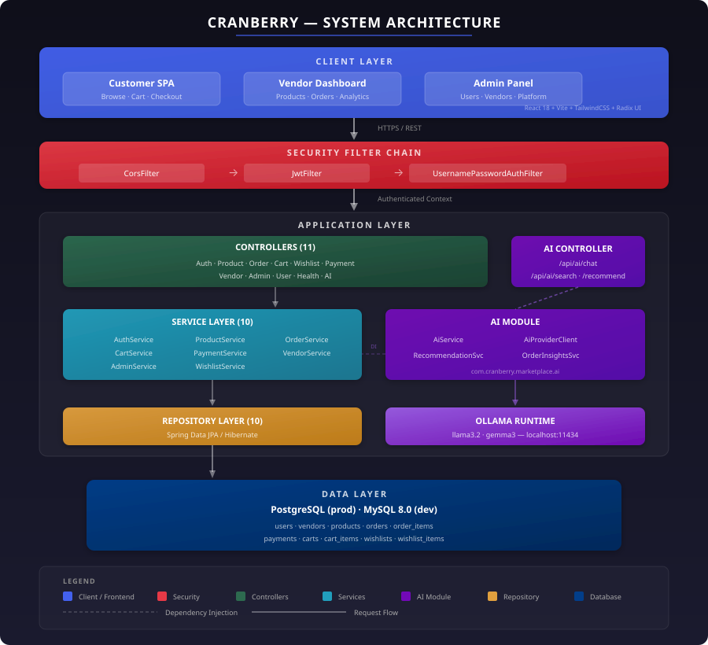
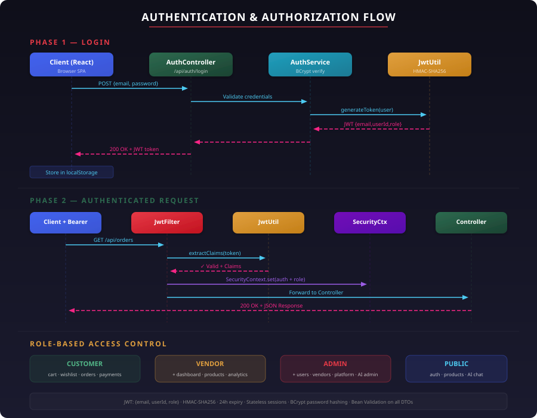
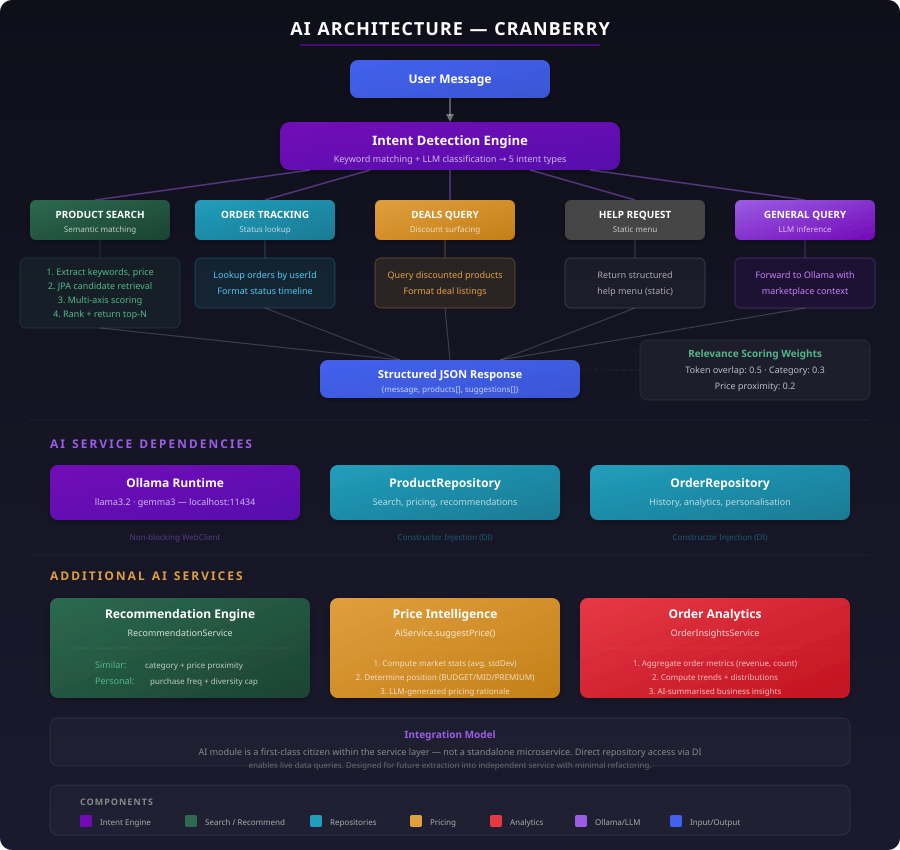

<div align="center">

# Cranberry

**AI-Powered Multi-Vendor E-Commerce Platform**

[](https://cranberry-ai-multivendor-e-commerce.vercel.app)
[](https://cranberry-ai-powered-multi-vendor-e.onrender.com/api/health)
[](https://openjdk.org)
[](https://spring.io/projects/spring-boot)
[](https://react.dev)
[](LICENSE)

</div>

---

## 🚀 Project Overview

Cranberry is a multi-vendor e-commerce platform with an integrated AI inference layer.

- **Three user roles** — Customer, Vendor, Admin — each with dedicated APIs, dashboards, and access-controlled workflows
- **Self-hosted LLM** (Ollama) embedded in the service layer for semantic search, conversational support, pricing intelligence, and recommendations
- **Zero external AI API dependency** — inference runs locally, eliminating per-request billing
- **Stack** — Spring Boot 3.4 · React 18 · MySQL/PostgreSQL · layered monolith with clean microservice extraction seams

---

## 🧠 Problem Statement

Multi-vendor marketplaces face compounding engineering challenges as they scale:

- **Search relevance degrades** — Keyword-only search fails on natural language queries, reducing conversion rates across vendor catalogs.
- **Vendor pricing lacks intelligence** — Independent sellers have no visibility into competitive positioning, resulting in suboptimal pricing and lost revenue.
- **Customer support scales linearly** — Without automation, support cost grows proportionally with user base — an unsustainable operational model.
- **Recommendation cold-start** — Traditional recommendation engines require large training datasets; new marketplaces cannot generate meaningful suggestions.
- **AI cost predictability** — Per-token API billing (OpenAI, Anthropic) introduces unpredictable variable cost that scales with every search, chat, and recommendation request.

**Approach:**

- Self-hosted inference (Ollama) converts AI from variable per-request cost to fixed infrastructure cost
- Intent-detection pipeline classifies and routes queries to specialised handlers
- Multi-axis relevance scoring (token overlap + category match + price proximity) replaces external ML pipelines
- Stateless JWT authentication and layered architecture support horizontal scaling without shared state

---

## ✨ Key Features

### Customer Features
- Semantic product search with natural language query decomposition
- Multi-turn AI chatbot — product discovery, order tracking, deal surfacing, general Q&A
- Personalized recommendations derived from purchase history and category affinity
- Persistent cart and wishlist with server-side state management
- Razorpay-integrated checkout with full order lifecycle tracking (placed → confirmed → shipped → delivered)
- Responsive interface across desktop and mobile viewports

### Vendor Features
- Real-time sales analytics dashboard with revenue metrics
- AI-powered price suggestion engine with market positioning analysis
- Product catalog CRUD with image upload management
- Order fulfillment workflow with explicit status transitions
- Performance metrics scoped to vendor-owned inventory

### Admin Features
- Platform-wide analytics and aggregated business intelligence
- Vendor approval and moderation pipeline
- Product and category management with activation/deactivation controls
- User management with role-based access enforcement
- AI-generated order insights summarizing platform-level trends

### AI Features
- **Conversational AI** — Multi-turn chatbot with intent classification across 5 intent types (product search, order tracking, deals, help, general)
- **Semantic Search** — Query decomposition → keyword/price/category extraction → multi-axis relevance scoring → ranked results
- **Recommendation Engine** — Category-weighted collaborative filtering with purchase frequency analysis and diversity constraints
- **Price Intelligence** — Real-time market statistics computation + LLM-generated competitive pricing rationale for vendors
- **Order Analytics** — Aggregated order data pipeline with AI-summarized business insights for admin dashboards

---

## 🏗️ System Architecture

Layered monolithic architecture with strict separation of concerns:

```
Controller Layer  →  Service Layer  →  Repository Layer  →  Database
     (REST API)      (Business Logic)    (Data Access)       (MySQL / PostgreSQL)
```

- **Cross-cutting concerns** — JWT auth, CORS, request validation — handled by Spring Security filter chain before controller dispatch
- **AI module** — independent vertical with its own controller (`AiController`), services (`AiService`, `RecommendationService`, `OrderInsightsService`), and non-blocking HTTP client (`AiProviderClient`) for Ollama
- **Isolation** — AI complexity is separated from core business logic via the `ai` package boundary while retaining direct repository access

### Architecture Diagram

> Full system topology: client layer, security filter chain, application layer (controllers, services, AI module), data access, and Ollama runtime.

```
┌─────────────────────────────────────────────────────────────────────┐
│                          CLIENT LAYER                               │
│                                                                     │
│    Customer SPA        Vendor Dashboard        Admin Panel          │
│    (React 18 + Vite + TailwindCSS + Radix UI / shadcn)             │
└──────────────────────────────┬──────────────────────────────────────┘
                               │ HTTPS / REST
┌──────────────────────────────▼──────────────────────────────────────┐
│                       SECURITY FILTER CHAIN                         │
│                                                                     │
│   CorsFilter  →  JwtFilter  →  UsernamePasswordAuthFilter          │
│   (Origin whitelist)   (Token extraction,    (Spring Security       │
│                         claim verification,   authentication        │
│                         role injection)        context setup)        │
└──────────────────────────────┬──────────────────────────────────────┘
                               │ Authenticated SecurityContext
┌──────────────────────────────▼──────────────────────────────────────┐
│                      APPLICATION LAYER                              │
│                                                                     │
│  ┌─────────────────────────────────────────────────────────────┐    │
│  │                   CONTROLLERS (11)                           │    │
│  │  Auth · Product · Order · Cart · Wishlist · Payment          │    │
│  │  Vendor · Admin · User · Health · AI                         │    │
│  └───────────────────────────┬─────────────────────────────────┘    │
│                              │                                      │
│  ┌───────────────────────────▼──────────┐  ┌────────────────────┐  │
│  │         SERVICE LAYER (10)           │  │    AI MODULE        │  │
│  │                                      │  │                    │  │
│  │  AuthService    ProductService       │  │  AiService         │  │
│  │  OrderService   CartService          │  │  AiProviderClient  │  │
│  │  PaymentService VendorService        │  │  RecommendationSvc │  │
│  │  AdminService   WishlistService      │  │  OrderInsightsSvc  │  │
│  └───────────────────────────┬──────────┘  └─────────┬──────────┘  │
│                              │                       │              │
│  ┌───────────────────────────▼───────┐  ┌────────────▼──────────┐  │
│  │     REPOSITORY LAYER (10)         │  │   OLLAMA RUNTIME      │  │
│  │   Spring Data JPA / Hibernate     │  │   llama3.2 · gemma3   │  │
│  └───────────────────┬───────────────┘  │   localhost:11434     │  │
│                      │                  └───────────────────────┘  │
└──────────────────────┼────────────────────────────────────────────┘
                       │
        ┌──────────────▼──────────────┐
        │    PostgreSQL (prod)        │
        │    MySQL 8.0 (dev)          │
        │                             │
        │  users · vendors · products │
        │  orders · order_items       │
        │  payments · carts           │
        │  cart_items · wishlists     │
        │  wishlist_items             │
        └─────────────────────────────┘
```

<p align="center">
  
</p>

---

## 🔐 Authentication & Authorization

### JWT Lifecycle

1. **Login** — Client sends credentials to `POST /api/auth/login`.
2. **Token Generation** — `JwtUtil.generateToken()` creates a signed JWT containing `email`, `userId`, and `role` claims. Algorithm: HMAC-SHA256. Expiry: 24 hours.
3. **Token Storage** — Client persists the JWT in local storage and attaches it to every subsequent request via the `Authorization: Bearer <token>` header.
4. **Filter Validation** — On each request, `JwtFilter` extracts the token, validates signature and expiry via `JwtUtil`, and injects the authenticated principal into Spring's `SecurityContext`.
5. **Role-Based Authorization** — Controllers receive pre-authenticated requests. Endpoint access is enforced at both the filter level and the controller level based on the `role` claim.

### Request Authentication Sequence

```
Client                      JwtFilter                   JwtUtil                 Controller
  │                            │                           │                        │
  │── POST /api/auth/login ───▶│                           │                        │
  │                            │                           │                        │
  │◀── JWT {email, userId, ────│                           │                        │
  │     role, exp: 24h,        │                           │                        │
  │     alg: HS256}            │                           │                        │
  │                            │                           │                        │
  │── GET /api/orders ─────────▶                           │                        │
  │   [Authorization: Bearer]  │── extractEmail(token) ───▶│                        │
  │                            │── extractRole(token) ────▶│                        │
  │                            │── isTokenValid(token) ───▶│                        │
  │                            │◀── validated claims ──────│                        │
  │                            │                           │                        │
  │                            │── SecurityContext.set(auth)──────────▶              │
  │                            │                           │     Process Request     │
  │◀────────────────── 200 OK + JSON Response ─────────────────────────│            │
```

### Role-Based Access Matrix

| Endpoint Pattern | Public | Customer | Vendor | Admin |
|-----------------|--------|----------|--------|-------|
| `POST /api/auth/**` | ✅ | ✅ | ✅ | ✅ |
| `GET /api/products/**` | ✅ | ✅ | ✅ | ✅ |
| `POST /api/ai/chat`, `/search` | ✅ | ✅ | ✅ | ✅ |
| `POST/PUT/DELETE /api/products/**` | ❌ | ❌ | ✅ | ✅ |
| `/api/cart/**`, `/api/wishlist/**` | ❌ | ✅ | ✅ | ✅ |
| `/api/orders/**`, `/api/payments/**` | ❌ | ✅ | ✅ | ✅ |
| `/api/vendor/dashboard`, `/orders` | ❌ | ❌ | ✅ | ✅ |
| `/api/ai/price-suggest` | ❌ | ❌ | ✅ | ✅ |
| `/api/admin/**` | ❌ | ❌ | ❌ | ✅ |
| `/api/ai/admin/**` | ❌ | ❌ | ❌ | ✅ |

### Security Implementation Details

- **Stateless sessions** — `SessionCreationPolicy.STATELESS` enforced globally; zero server-side session storage.
- **CORS** — Explicit origin, method, and header whitelisting via `CorsConfig`.
- **Password hashing** — BCrypt via Spring Security's `BCryptPasswordEncoder`.
- **Input validation** — Bean Validation (`@Valid`) on all request DTOs with Zod schema validation on the client.
- **SQL injection prevention** — Parameterized queries enforced through JPA/Hibernate.

> **Diagram:** Login sequence, token validation lifecycle, and role-based endpoint access matrix.

<p align="center">
  
</p>

---

## 🤖 AI Architecture

Dedicated module at `com.cranberry.marketplace.ai` — four components integrated into the service layer via constructor injection.

### Component Map

| Component | Class | Responsibility |
|-----------|-------|----------------|
| **LLM Client** | `AiProviderClient` | HTTP interface to Ollama runtime. Handles prompt construction, response parsing, model fallback (llama3.2 → gemma3), and health checking. |
| **Core AI Service** | `AiService` | Intent detection, semantic search, recommendation orchestration, price suggestions. Coordinates LLM calls with live database queries. |
| **Recommendation Engine** | `RecommendationService` | Category-weighted collaborative filtering. Analyses purchase history, applies diversity constraints, and generates personalized product sets. |
| **Order Intelligence** | `OrderInsightsService` | Aggregates order metrics across the platform and generates AI-summarized business intelligence for admin dashboards. |

### Intent Detection & Routing Pipeline

Every chatbot message passes through a multi-stage classification and routing pipeline:

```
User Message
     │
     ▼
┌─────────────────┐
│ Intent Detection │ ← Keyword matching + LLM classification
│ (5 intent types) │
└────────┬────────┘
         │
    ┌────┼────────────┬──────────────┬──────────────┐
    ▼    ▼            ▼              ▼              ▼
 PRODUCT  ORDER      DEALS        HELP          GENERAL
 SEARCH   TRACKING   QUERY        REQUEST       QUERY
    │       │          │             │              │
    ▼       ▼          ▼             ▼              ▼
 Extract   Lookup    Fetch top     Return        Forward to
 keywords, orders    discounted    structured    LLM with
 price     by user   products      help menu     marketplace
 range,    ID from   from DB                     context
 category  DB                                    prompt
    │       │          │             │              │
    ▼       ▼          ▼             ▼              ▼
 DB Query  Format    Format        Static        LLM
 + Score   order     deal          response      inference
 + Rank    status    listings                    + parse
    │       │          │             │              │
    └───────┴──────────┴─────────────┴──────────────┘
                       │
                       ▼
              Structured JSON Response
              {message, products[], suggestions[]}
```

### Semantic Search Pipeline

1. **Query Decomposition** — Extract keywords, min/max price constraints, and category signals from natural language input using regex-based heuristics.
2. **Candidate Retrieval** — JPA queries against the product table using extracted filters.
3. **Multi-Axis Relevance Scoring** — Each candidate is scored across three dimensions:
   - Token overlap between query terms and product `name + description` (weight: 0.5)
   - Category match against extracted category signal (weight: 0.3)
   - Price proximity to query constraints (weight: 0.2)
4. **Ranking & Response** — Sort by composite score, return top-N results with LLM-generated search insight.

### Recommendation Algorithms

| Mode | Input | Algorithm |
|------|-------|-----------|
| **Similar Products** | `productId` | Retrieve same-category products → rank by price proximity + name token similarity → exclude source product |
| **Personalized** | `userId` | Analyse order history → extract category frequency distribution → retrieve unseen products weighted by purchase frequency → apply diversity cap per category |

### AI Price Suggestion Engine

```
Vendor submits: {productName, category, intendedPrice}
     │
     ▼
Query all products in same category
     │
     ▼
Compute: avgPrice, priceRange, stdDev, percentile position
     │
     ▼
Determine market position: BUDGET | MID_RANGE | PREMIUM
     │
     ▼
Construct prompt with market context → Send to Ollama
     │
     ▼
Return: {recommendedPrice, confidence, marketPosition, aiInsights}
```

### Integration Model

The AI module is **not** a standalone microservice — it is a first-class citizen within the service layer. `AiService` depends on `ProductRepository` and `OrderRepository` via constructor injection for live data access. This avoids inter-service latency while the `ai` package boundary maintains clean separation. Repository dependencies map directly to REST API contracts, enabling future extraction with minimal refactoring.

> **Diagram:** Intent detection pipeline, semantic search scoring, recommendation engine, price intelligence, and service dependencies.

<p align="center">
  
</p>

---

## ⚙️ Tech Stack

| Category | Technologies |
|----------|-------------|
| **Frontend** | React 18, Vite 7.3, TailwindCSS 3.4, Radix UI + shadcn/ui, React Router 7.5, React Hook Form + Zod |
| **Backend** | Java 17, Spring Boot 3.4.2, Spring Security 6.x, Spring Data JPA / Hibernate |
| **AI** | Ollama (self-hosted), llama3.2, gemma3, Spring WebFlux WebClient (non-blocking HTTP) |
| **Database** | PostgreSQL 16 (production), MySQL 8.0 (development) |
| **Payments** | Razorpay Java SDK 1.4.7 |
| **Tools / Environment** | Maven, Vercel (frontend CDN), Render (backend containers), Git |

---

## 📊 Engineering Decisions & Scalability

| Decision | Rationale |
|----------|-----------|
| **Spring Boot 3.4** | Auto-configuration, native JPA/Security/Validation support, clear Spring Cloud upgrade path for microservice decomposition. |
| **Stateless JWT** | No server-side session storage. Any instance validates any request independently — prerequisite for horizontal scaling without sticky sessions. |
| **Layered Architecture** | `Controller → Service → Repository` enforces single-responsibility per tier. Services independently testable. Clean seams for bounded context extraction. |
| **Multi-Vendor Data Model** | `Vendor` as first-class entity with product ownership, order visibility, analytics scoping. Tenant isolation via vendor ID filtering at the service layer. |
| **Self-Hosted LLM** | Fixed infrastructure cost vs. per-token API billing. Full control over model selection, prompt templates, inference latency. Zero vendor lock-in. |
| **Non-Blocking WebClient** | Ollama calls via `WebClient` prevent LLM inference latency (2–10s) from consuming servlet threads. |

**Scaling posture:** Stateless APIs (load balancer + instances). Domain-isolated services (extractable without schema changes). CPU-only JWT validation. HikariCP connection pooling. AI inference offloaded to dedicated Ollama process.

---

## 🚀 Future Engineering Roadmap

| Priority | Area | Implementation | Expected Impact |
|----------|------|----------------|-----------------|
| **P0** | Caching | Redis cache for product catalogue, search results, and vendor analytics. Write-through invalidation on product mutations. | ~60% reduction in database read load |
| **P0** | CI/CD | GitHub Actions: lint → test → build → Docker image → staged deployment | Automated quality gates, zero-downtime deployments |
| **P1** | Event-Driven Processing | Kafka topics for `order.created`, `payment.verified`, `order.shipped`. Consumers handle inventory updates, notification dispatch, analytics ingestion. | Decoupled order pipeline, async processing, retry semantics |
| **P1** | Microservices Decomposition | Extract bounded contexts: `ai-service`, `payment-service`, `order-service`. Inter-service communication via REST + Kafka events. | Independent scaling, isolated failure domains, team-parallel development |
| **P1** | Containerisation | Dockerfile per service, `docker-compose.yml` for local stack, Kubernetes manifests for production. | Environment parity, reproducible builds, orchestration readiness |
| **P2** | Vector Search | pgvector extension for product description embeddings. Replace keyword scoring with cosine similarity on dense vectors. | True semantic similarity, ~3x relevance improvement on ambiguous queries |
| **P2** | Observability | Structured logging (ELK), distributed tracing (OpenTelemetry), metrics (Prometheus + Grafana). | Production debugging, SLA monitoring, performance profiling |
| **P2** | AI Personalisation | User behaviour embeddings (click, cart, purchase signals). Real-time feature store for recommendation model input. | Context-aware recommendations, reduced cold-start, improved conversion |

---

## 🧪 Local Setup

### Backend Setup

1. Clone the repository:
   ```bash
   git clone https://github.com/aryangaikwad-966/Cranberry-AI-Powered-Multi-Vendor-E-Commerce-Platform-.git
   cd Cranberry-AI-Powered-Multi-Vendor-E-Commerce-Platform-/Cranberry-Backend
   ```

2. Configure environment variables:
   ```bash
   cp .env.example .env
   # Set: DB_URL, DB_USERNAME, DB_PASSWORD, RAZORPAY_KEY_ID, RAZORPAY_KEY_SECRET
   ```

3. Start the backend:
   ```bash
   ./mvnw spring-boot:run
   # Starts on http://localhost:8080
   ```

### Frontend Setup

1. Install dependencies and start the dev server:
   ```bash
   cd Cranberry-Frontend
   npm install
   npm run dev
   # Starts on http://localhost:5173
   ```

### AI Setup (Optional)

```bash
curl -fsSL https://ollama.ai/install.sh | sh
ollama pull llama3.2
ollama pull gemma3
curl http://localhost:11434/api/tags   # Verify models are available
```

### Verification

| Service | Endpoint | Expected |
|---------|----------|----------|
| Frontend | `http://localhost:5173` | React application loads |
| Backend | `http://localhost:8080/api/health` | `{"status": "UP"}` |
| AI | `http://localhost:8080/api/ai/health` | `{"ollama_available": true}` |

---

## 📸 Screenshots

<div align="center">

| Home Page | Product Discovery | Shopping Cart |
|-----------|------------------|---------------|
|  |  |  |

| Product Detail | Checkout | Razorpay Payment |
|----------------|----------|------------------|
|  |  |  |

| Vendor Dashboard | Admin Panel |
|------------------|-------------|
|  |  |

</div>

---

## 📈 Engineering Skills Demonstrated

| Domain | Demonstrated Capability |
|--------|------------------------|
| **System Design** | Multi-tenant data model with 11 entities, role-based access control, layered service architecture with clean package boundaries, API contract design across 11 controllers. |
| **Backend Architecture** | Spring Boot application with JPA entity relationships (1:1, 1:N, M:N), transactional service logic, custom Spring Security filter chain, stateless session management, and 28 request/response DTOs. |
| **Secure Authentication** | JWT lifecycle implementation (generation, validation, claim extraction), RBAC with endpoint-level access control, BCrypt password hashing, CORS policy configuration, input validation pipeline. |
| **AI Integration** | LLM integration via non-blocking HTTP client, prompt engineering for intent detection and insight generation, semantic search with multi-axis relevance scoring, recommendation algorithm with diversity constraints. |
| **Full-Stack Coordination** | React SPA consuming RESTful APIs, client-side form validation (Zod) mirroring server-side validation, role-aware UI rendering, real-time dashboard data binding. |
| **Payment Systems** | Razorpay SDK integration with order lifecycle management, payment creation and signature verification, idempotent transaction handling. |

---

## 🎯 Summary

Covers the full vertical: relational schema design, secure REST APIs, LLM-powered semantic search, payment processing, and multi-vendor tenant isolation. Architectural decisions — stateless authentication, layered services, self-hosted inference, multi-tenant data modelling — are deliberate trade-offs documented with engineering rationale. Suitable for evaluation in backend engineering, AI engineering, and full-stack roles at the graduate and industry level.

---

<div align="center">

**Built by [Aryan Gaikwad](https://github.com/aryangaikwad-966)**

[](https://github.com/aryangaikwad-966)
[](LICENSE)

</div>