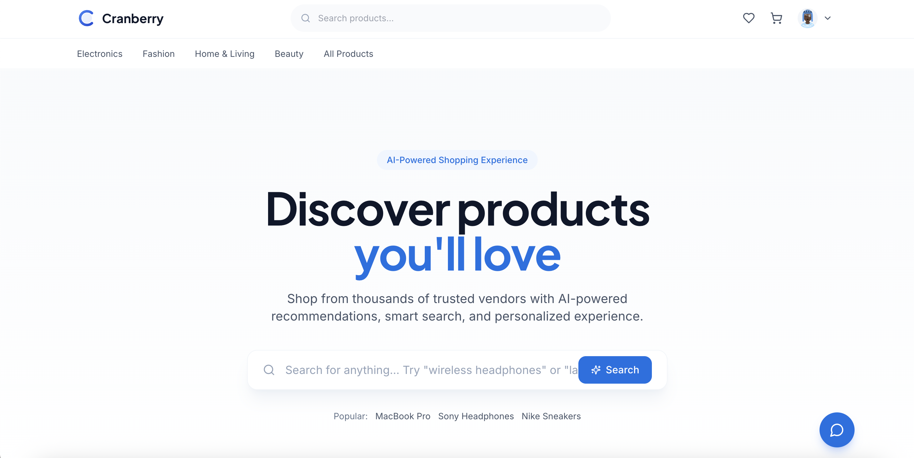
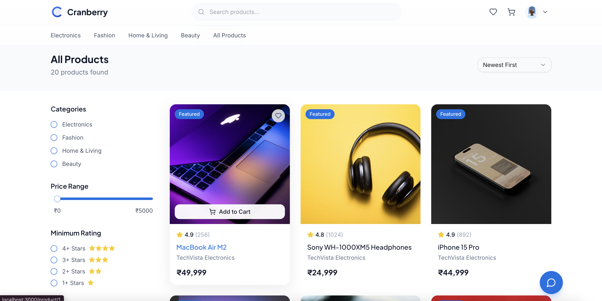
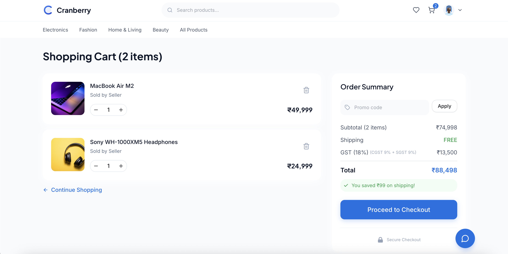
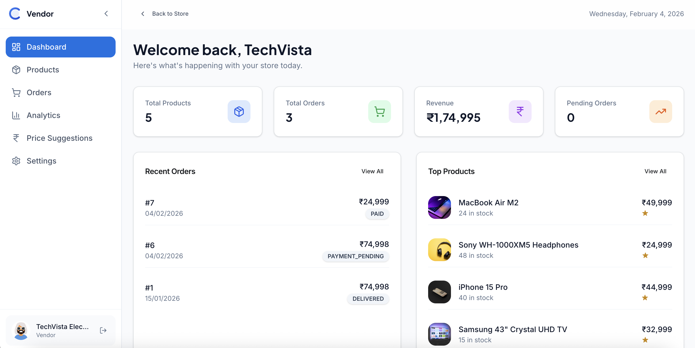
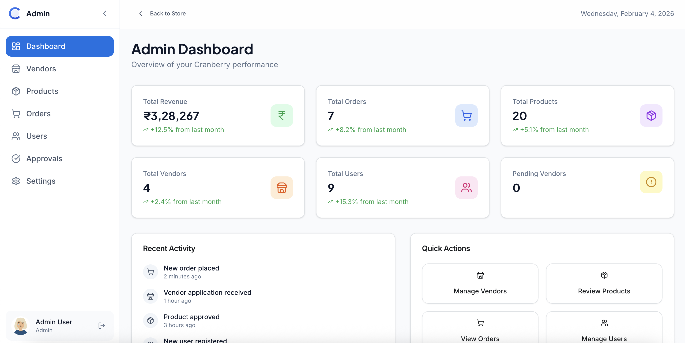
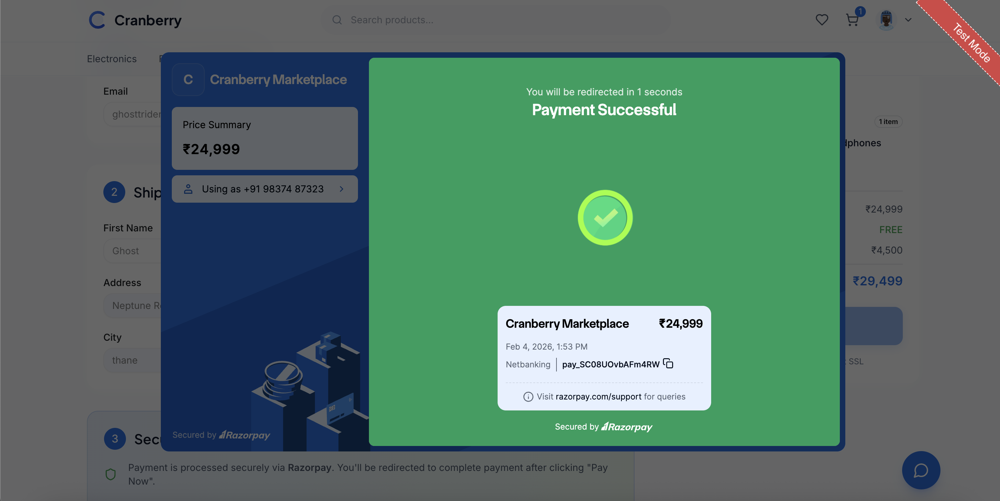

<div align="center">

# Cranberry

### AI-Powered Multi-Vendor E-Commerce Platform

[**Live Demo**](https://cranberry-ai-multivendor-e-commerce.vercel.app) ·
[**API**](https://cranberry-ai-powered-multi-vendor-e.onrender.com/api/health) ·
[**Documentation**](Cranberry-Backend/API_DOCUMENTATION.md)

<br />

**Full-stack marketplace with self-hosted LLM inference for semantic search, chatbot, recommendations, and pricing intelligence**

<br />


</div>

<br />

---

## Overview

Production-deployed e-commerce platform supporting **3 user roles** (Customer, Vendor, Admin) with integrated AI capabilities. All LLM inference runs locally via **Ollama** — eliminating per-request API costs.

| Metric | Count | Details |
|--------|-------|---------|
| **REST Endpoints** | 11 | Auth, Products, Orders, Cart, Wishlist, Payments, Vendor, Admin, AI |
| **Database Tables** | 9 | Users, Vendors, Products, Orders, OrderItems, Payments, Carts, CartItems, Wishlists |
| **DTOs** | 28 | Request/response objects with Bean Validation |
| **AI Intents** | 5 | Product search, Order tracking, Deals, Help, General Q&A |

<br />

---

## Screenshots

<table>
<tr>
<td width="33%"></td>
<td width="33%"></td>
<td width="33%"></td>
</tr>
<tr>
<td align="center"><b>Home</b></td>
<td align="center"><b>Product Discovery</b></td>
<td align="center"><b>Shopping Cart</b></td>
</tr>
<tr>
<td width="33%"></td>
<td width="33%"></td>
<td width="33%"></td>
</tr>
<tr>
<td align="center"><b>Vendor Dashboard</b></td>
<td align="center"><b>Admin Panel</b></td>
<td align="center"><b>Razorpay Checkout</b></td>
</tr>
</table>

<br />

---

## System Architecture

<p align="center">
  
</p>

<br />

---

## AI Pipeline

<p align="center">
  
</p>

**Semantic Search Pipeline:**
```
User Query → Intent Detection → Query Decomposition → Candidate Retrieval → Relevance Scoring → Ranked Results
                                      │
                    ┌─────────────────┼─────────────────┐
                    ▼                 ▼                 ▼
              Keywords           Price Range        Category
              (weight: 0.5)      (weight: 0.2)     (weight: 0.3)
```

<br />

---

## Authentication Flow

<p align="center">
  
</p>

**Security Implementation:**
| Component | Technology |
|-----------|------------|
| Token | JWT with HMAC-SHA256, 24h expiry |
| Password | BCrypt hashing |
| Sessions | Stateless (no server-side storage) |
| RBAC | Customer / Vendor / Admin roles |

<br />

---

## Database Schema

```
┌─────────────────────────────────────────────────────────────────────────────────┐
│                              DATABASE RELATIONSHIPS                              │
├─────────────────────────────────────────────────────────────────────────────────┤
│                                                                                 │
│   ┌──────────┐      1:1      ┌──────────┐      1:N      ┌──────────────┐       │
│   │  USERS   │──────────────►│  VENDOR  │──────────────►│   PRODUCT    │       │
│   │          │               │          │               │              │       │
│   │ • email  │               │ • shop   │               │ • name       │       │
│   │ • role   │               │ • status │               │ • price      │       │
│   └────┬─────┘               └──────────┘               │ • category   │       │
│        │                                                └──────┬───────┘       │
│        │ 1:N                                                   │               │
│        ▼                                                       │ N:1           │
│   ┌──────────┐      1:1      ┌──────────┐      N:1             │               │
│   │  ORDERS  │──────────────►│ PAYMENTS │                      │               │
│   │          │               │          │                      │               │
│   │ • total  │               │ • rzp_id │                      │               │
│   │ • status │               │ • amount │                      │               │
│   └────┬─────┘               └──────────┘                      │               │
│        │                                                       │               │
│        │ 1:N                                                   │               │
│        ▼                                                       ▼               │
│   ┌──────────────┐                                    ┌──────────────┐         │
│   │  ORDER_ITEM  │◄───────────────────────────────────│  CART_ITEM   │         │
│   │              │         (product_id FK)            │              │         │
│   │ • quantity   │                                    │ • quantity   │         │
│   │ • price      │                                    └──────────────┘         │
│   └──────────────┘                                           ▲                 │
│                                                              │ 1:N             │
│   ┌──────────┐      1:1      ┌──────────┐                    │                 │
│   │ WISHLIST │◄──────────────│  CARTS   │◄───────────────────┘                 │
│   └──────────┘   (user_id)   └──────────┘    (user_id FK)                      │
│                                                                                 │
└─────────────────────────────────────────────────────────────────────────────────┘
```

| Relationship | Type | Description |
|-------------|------|-------------|
| Users → Vendor | 1:1 | One user can become one vendor |
| Vendor → Products | 1:N | Vendor owns multiple products |
| Users → Orders | 1:N | User places multiple orders |
| Orders → OrderItems | 1:N | Order contains multiple items |
| Orders → Payments | 1:1 | One payment per order (Razorpay) |
| Users → Cart | 1:1 | One persistent cart per user |

<br />

---

## Technical Highlights

<table>
<tr>
<td width="50%" valign="top">

### System Design
- Multi-tenant architecture with vendor isolation
- Layered monolith with microservice extraction seams
- Stateless JWT for horizontal scaling

### Backend Engineering
- Spring Boot 3.4 + Spring Security 6 filter chain
- JPA relationships (1:1, 1:N, M:N) with cascades
- HikariCP connection pooling
- Global exception handling

</td>
<td width="50%" valign="top">

### AI/ML Integration
- Self-hosted LLM (Ollama) — zero API costs
- 5-intent classification pipeline
- Composite relevance scoring algorithm
- Non-blocking WebClient for inference

### Full-Stack
- React 18 with role-aware routing
- Zod validation mirroring server-side
- shadcn/ui component library
- Razorpay payment integration

</td>
</tr>
</table>

<br />

---

## Tech Stack

| Layer | Technologies |
|-------|--------------|
| **Backend** | Java 17, Spring Boot 3.4, Spring Security 6, Spring Data JPA, Hibernate |
| **Frontend** | React 18, Vite, TailwindCSS, shadcn/ui, React Router, Zod |
| **AI/ML** | Ollama (self-hosted), llama3.2, gemma3, WebFlux WebClient |
| **Database** | PostgreSQL 16 (prod), MySQL 8 (dev) |
| **Infrastructure** | Vercel (frontend), Render (backend), Maven |

<br />

---

## Quick Start

```bash
# Clone
git clone https://github.com/aryangaikwad-966/Cranberry-AI-Powered-Multi-Vendor-E-Commerce-Platform-.git
cd Cranberry-AI-Powered-Multi-Vendor-E-Commerce-Platform-

# Backend (Java 17+)
cd Cranberry-Backend && ./mvnw spring-boot:run

# Frontend (Node 18+)
cd Cranberry-Frontend && npm install && npm run dev

# AI (optional)
ollama pull llama3.2 && ollama pull gemma3
```

| Service | URL | Verify |
|---------|-----|--------|
| Frontend | http://localhost:5173 | UI loads |
| Backend | http://localhost:8080/api/health | `{"status":"UP"}` |
| Ollama | http://localhost:11434/api/tags | Model list |

<br />

---

## Project Structure

```
├── Cranberry-Backend/
│   └── src/main/java/com/cranberry/marketplace/
│       ├── controller/      # 11 REST controllers
│       ├── service/         # 10 business services
│       ├── repository/      # 10 JPA repositories  
│       ├── model/           # 9 entity classes
│       ├── dto/             # 28 DTOs
│       ├── security/        # JWT filter, CORS
│       ├── config/          # App configuration
│       ├── exception/       # Global error handling
│       └── ai/              # AI module
│
├── Cranberry-Frontend/
│   └── src/
│       ├── components/      # shadcn/ui + custom
│       ├── pages/           # Customer, Vendor, Admin
│       ├── context/         # Auth, Cart, Wishlist
│       ├── services/        # API client
│       └── hooks/           # Custom hooks
│
└── docs/diagrams/           # Architecture SVGs
```

<br />

---

## Documentation

| Document | Description |
|----------|-------------|
| [API_DOCUMENTATION.md](Cranberry-Backend/API_DOCUMENTATION.md) | Complete REST API reference |
| [SETUP_GUIDE.md](Cranberry-Backend/SETUP_GUIDE.md) | Environment setup & configuration |
| [database_setup.sql](Cranberry-Backend/database_setup.sql) | Full database schema |

<br />

---

<div align="center">

**Built by [Aryan Gaikwad](https://github.com/aryangaikwad-966)**

[MIT License](LICENSE)

</div>